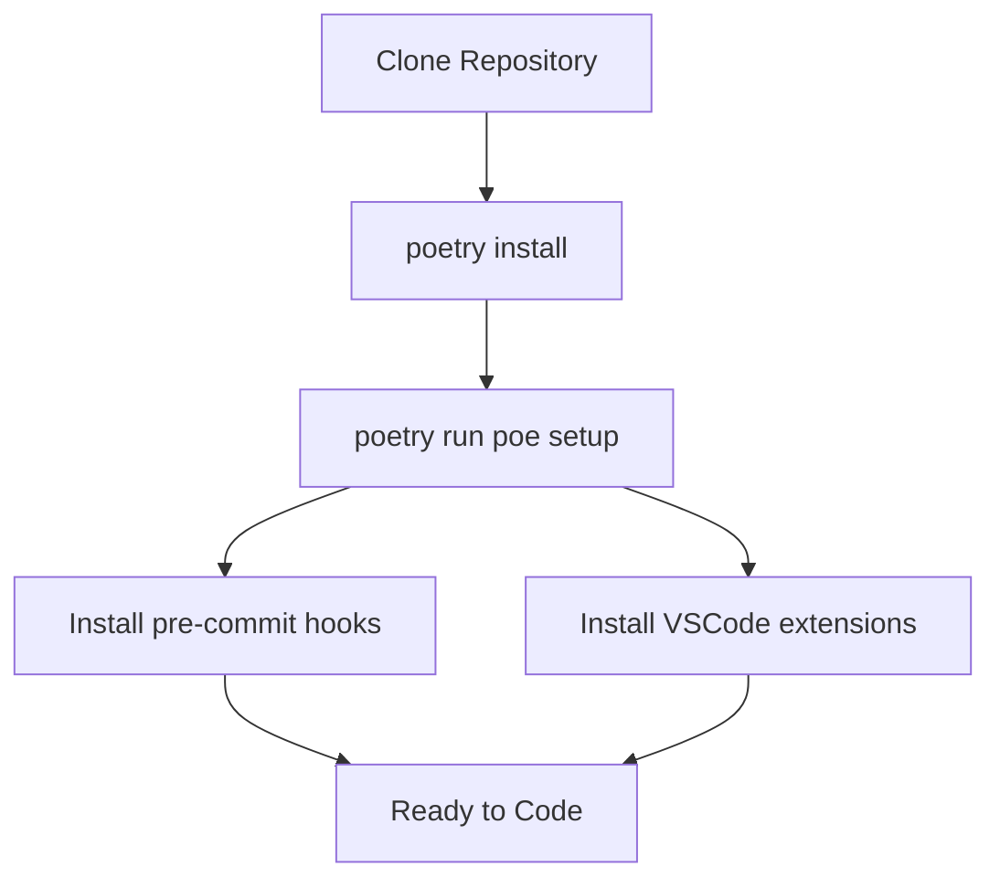
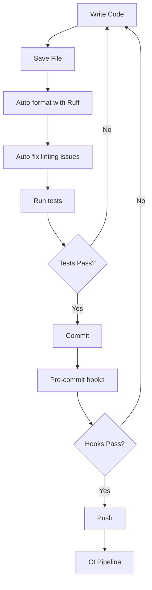

# Architecture Documentation

This document describes the architectural decisions, patterns, and structure of the Python project template.

## Overview

This is an AI-native Python project template designed for modern Python development with comprehensive tooling, quality checks, and AI assistant integration (Cursor, GitHub Copilot).

### Design Principles

1. **AI-Native**: Optimized for working with AI coding assistants
2. **Quality First**: Automated checks ensure production-grade code
3. **Developer Experience**: Fast feedback loops and clear conventions
4. **Security**: Built-in secret detection and vulnerability scanning
5. **Simplicity**: Minimal boilerplate, maximum functionality

## Project Structure

```
python-template/
├── src/                          # Source code (importable package)
│   └── main.py                  # Entry point
│
├── tests/                        # Test suite
│   ├── __init__.py
│   ├── conftest.py              # Shared fixtures
│   └── test_main.py             # Tests mirror src/ structure
│
├── docs/                         # Documentation
│   ├── ARCHITECTURE.md          # This file
│   ├── ARCHITECTURE.mermaid     # Architecture diagram
│   ├── CHANGELOG.md             # Change history
│   ├── MEMORY_BANK.md           # ADR and key decisions
│   ├── PROJECT_SPEC.md          # Project specification
│   └── TECHNICAL.md             # Technical details
│
├── .cursor/                      # Cursor IDE integration
│   ├── commands/                # Custom commands
│   │   └── commit.md           # Commit workflow
│   ├── hooks/                   # Cursor hooks
│   │   ├── setup.sh            # Project setup
│   │   ├── check-shell.sh      # Shell validation
│   │   ├── format-and-lint.sh  # Code quality
│   │   └── final-check.sh      # Final validation
│   ├── rules/                   # AI agent rules
│   │   ├── shared-rules.mdc    # Core rules (single source)
│   │   ├── python-standard.mdc # Project standards
│   │   ├── python-core.mdc     # Python best practices
│   │   ├── python-types.mdc    # Type checking
│   │   ├── python-testing.mdc  # Testing guidelines
│   │   ├── python-async.mdc    # Async patterns
│   │   ├── python-security.mdc # Security requirements
│   │   └── conventional-commits.mdc
│   ├── AGENTS.md                # Agent configuration reference
│   └── hooks.json               # Hook configuration
│
├── .github/                      # GitHub integration
│   ├── workflows/               # CI/CD workflows
│   ├── prompts/                 # AI prompts
│   ├── copilot-instructions.md  # Copilot configuration
│   └── PULL_REQUEST_TEMPLATE.md # PR template
│
├── .vscode/                      # VSCode/Cursor settings
│   ├── extensions.json          # Required extensions
│   └── settings.json            # Workspace configuration
│
├── pyproject.toml               # Project configuration
├── poetry.lock                  # Locked dependencies
├── Makefile                     # Make commands
├── .pre-commit-config.yaml      # Pre-commit hooks
└── README.md                    # Main documentation
```

## Architectural Layers

### 1. Source Code Layer (`src/`)

**Purpose**: Contains all application source code.

**Conventions**:
- Use a package structure (`src/package_name/`)
- Each module should have a clear, single responsibility
- Public APIs exported via `__init__.py`
- Type hints required for all functions
- Docstrings required for all public interfaces

**Patterns**:
- Functional programming preferred over OOP where appropriate
- Pure functions without side effects
- Classes used for stateful objects and external system interfaces
- Dependency injection for testability

### 2. Test Layer (`tests/`)

**Purpose**: Comprehensive test coverage with pytest.

**Conventions**:
- Mirror `src/` directory structure
- Test files named `test_*.py`
- Minimum 80% code coverage required
- Use fixtures for shared test data
- Parametrize for multiple test cases

**Patterns**:
- Arrange-Act-Assert (AAA) pattern
- One assertion per test (generally)
- Mock external dependencies
- Test both happy path and error cases

### 3. Documentation Layer (`docs/`)

**Purpose**: Project documentation for developers and AI assistants.

**Files**:
- `ARCHITECTURE.md`: This file - architectural decisions
- `ARCHITECTURE.mermaid`: Visual architecture diagram
- `CHANGELOG.md`: Version history and changes
- `MEMORY_BANK.md`: ADR for key decisions
- `PROJECT_SPEC.md`: Project requirements and goals
- `TECHNICAL.md`: Technical stack and tools

### 4. AI Integration Layer (`.cursor/`, `.github/`)

**Purpose**: Enable seamless AI-assisted development.

**Key Components**:
- **Shared Rules** (`.cursor/rules/shared-rules.mdc`): Single source of truth for AI behavior
- **Commands**: Guided workflows (e.g., commit)
- **Hooks**: Automated checks and validations
- **Prompts**: Reusable AI prompts

**Design Decision**: Single source for rules, referenced by both Cursor and GitHub Copilot to avoid duplication.

### 5. Configuration Layer

**Purpose**: Centralized tool configuration.

**Key Files**:
- `pyproject.toml`: All Python tool configs (Ruff, mypy, pytest, coverage, Bandit)
- `.pre-commit-config.yaml`: Pre-commit hook configuration
- `.vscode/settings.json`: IDE settings
- `Makefile` + `poe tasks`: Task definitions

## Key Architectural Decisions

### 1. Poetry for Dependency Management

**Rationale**: Modern, reliable, deterministic dependency resolution with lock files.

**Trade-offs**:
- ✅ Better than pip/requirements.txt
- ✅ Built-in virtual environment management
- ✅ Lock files for reproducibility
- ❌ Requires Poetry installation
- ❌ Not as universal as pip

### 2. Ruff for Linting and Formatting

**Rationale**: 10-100x faster than traditional tools, replaces black/isort/flake8.

**Trade-offs**:
- ✅ Extremely fast
- ✅ Comprehensive rule set
- ✅ Single tool replaces many
- ✅ Active development
- ❌ Relatively new (less mature than alternatives)

### 3. Strict Type Checking with mypy

**Rationale**: Catch bugs early, better IDE support, self-documenting code.

**Trade-offs**:
- ✅ Prevents runtime type errors
- ✅ Better refactoring support
- ✅ Serves as documentation
- ❌ More verbose code
- ❌ Learning curve for complex types

### 4. Pre-commit Hooks

**Rationale**: Automated quality gates prevent bad code from being committed.

**Trade-offs**:
- ✅ Catches issues early
- ✅ Consistent code quality
- ✅ Reduces CI failures
- ❌ Slower commit process
- ❌ Can be bypassed (--no-verify)

### 5. Single Source for AI Rules

**Rationale**: Avoid duplication between Cursor and GitHub Copilot configurations.

**Trade-offs**:
- ✅ Single source of truth
- ✅ Easier to maintain
- ✅ Consistent AI behavior
- ❌ Requires reference structure
- ❌ Tool-specific rules need separate files

## Development Workflow

### Setup Flow



### Development Flow



### Quality Gates

1. **Save**: Auto-format and fix linting
2. **Commit**: Pre-commit hooks (fast checks)
3. **Push**: Full test suite
4. **PR**: CI pipeline with full checks

## Extension Points

### Adding New Dependencies

```bash
# Production dependency
poetry add <package-name>

# Development dependency
poetry add <package-name> --group dev
```

### Adding New Modules

1. Create module in `src/`
2. Add type hints and docstrings
3. Create corresponding test file in `tests/`
4. Ensure 80%+ coverage

### Adding New Rules

1. Create `.cursor/rules/your-rule.mdc`
2. Set `alwaysApply: true` or apply conditionally
3. Document in `.cursor/AGENTS.md`

### Adding New Commands

1. Create `.cursor/commands/your-command.md`
2. Define workflow steps
3. Document in README

### Adding New Hooks

1. Update `.cursor/hooks.json`
2. Create shell script in `.cursor/hooks/`
3. Make executable: `chmod +x`

## Testing Strategy

### Unit Tests
- Test individual functions and classes
- Mock external dependencies
- Fast execution (<1s per test)
- 80%+ coverage required

### Integration Tests
- Test component interactions
- Use real dependencies where practical
- Mark with `@pytest.mark.integration`
- Optional in CI (slower)

### Test Organization
```python
# tests/test_module.py
def test_function_happy_path():
    # Arrange
    input_data = ...

    # Act
    result = function(input_data)

    # Assert
    assert result == expected
```

## Security Architecture

### Secret Management
- Environment variables for configuration
- `.env` files (never committed)
- detect-secrets scans on commit

### Dependency Security
- Bandit scans for vulnerabilities
- Dependabot for automated updates
- Regular security audits

### Input Validation
- Validate all external inputs
- Use type checking
- Sanitize before logging

## Performance Considerations

### Testing
- Parallel execution with pytest-xdist
- Fast unit tests (<1s each)
- Slower integration tests marked separately

### Linting
- Ruff is 10-100x faster than traditional tools
- Pre-commit caching speeds up subsequent runs

### Development
- Virtual environment isolation
- Incremental type checking with mypy

## Future Considerations

### Potential Enhancements
- Docker support for containerization
- GitHub Actions workflow templates
- Additional pre-configured tools (e.g., coverage badges)
- Example application structure
- API documentation generation (Sphinx/MkDocs)

### Scalability
- Template suitable for small to medium projects
- Large projects may need additional structure
- Consider monorepo tools for multi-package projects

## References

- [Python Packaging Guide](https://packaging.python.org/)
- [Poetry Documentation](https://python-poetry.org/docs/)
- [Ruff Documentation](https://docs.astral.sh/ruff/)
- [mypy Documentation](https://mypy.readthedocs.io/)
- [pytest Best Practices](https://docs.pytest.org/en/stable/goodpractices.html)
